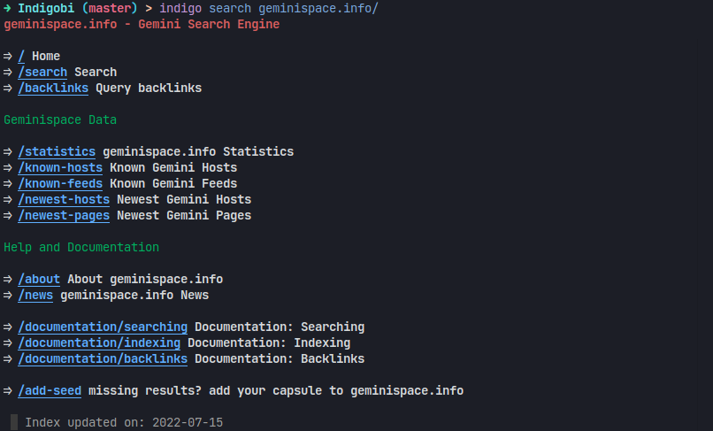

# Indigobi

Indigobi is a WIP **Gemini client** written in OCaml.

<p align="center">
  
</p>

## Features

- Pretty gemini pages rendering.
- External file in their default app opening.
- Cross-platform (Works on Darwin, UNIX, Windows and *BSD).
- Browsable history.

#### Not yet implemented

- A TUI with `lambda-term`.

## Installing

### By hand

```
$ make deps
$ make build
$ make install
```

It assumes you have an opam switch setup for OCaml 4.13. If not:

```
$ opam init
$ opam switch create indigobi 4.13.0
$ eval $(opam env)
```

### Using makepkg

```
$ makepkg
```

## Contributing

Pull requests, bug reports, and feature requests are welcome.

## License

- **GPL 3.0** or later. See [license](LICENSE) for more information.
